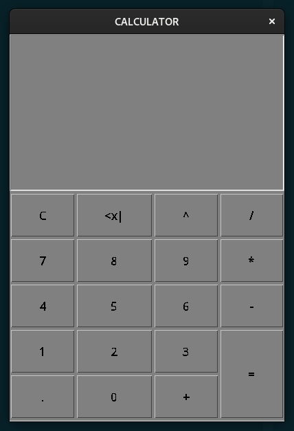
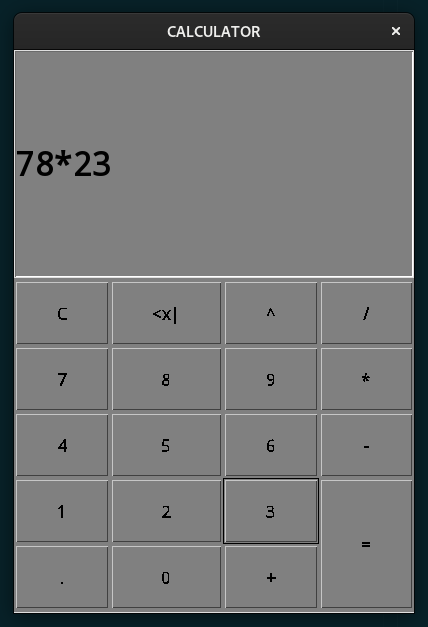
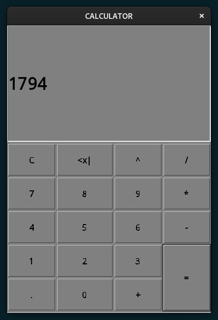

# Calculator
A Calculator built for practical implimentation of learning. 
This Calculator supports basic functionality like addition, subtraction, multiplication, division and exponentiation. Also suppots operations on floating point values. 

Backspace and clear screen also working. 
# Basic working:

Type in the expression. Use onscreen keyboard. 

 

And press =. 

You are welcome to improve or learn from this. 